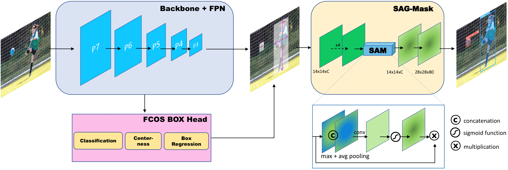
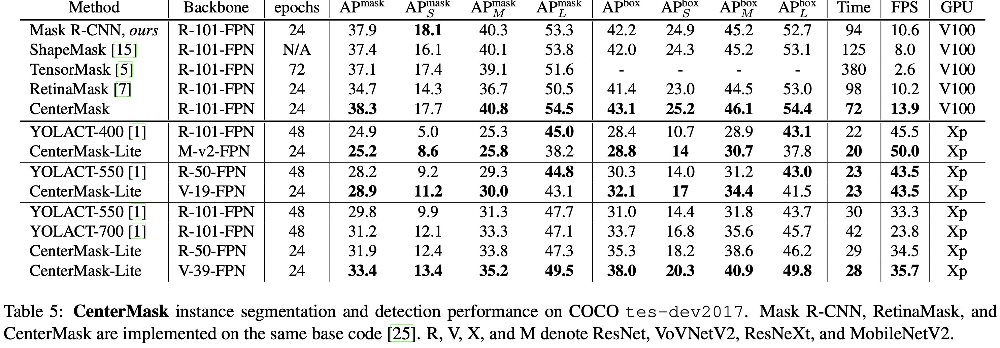

# [CenterMask](https://arxiv.org/abs/1911.06667) : Real-Time Anchor-Free Instance Segmentation




## Abstract

We propose a simple yet efficient anchor-free instance segmentation, called **CenterMask**, that adds a novel spatial attention-guided mask (SAG-Mask) branch to anchor-free one stage object detector (FCOS) in the same vein with Mask R-CNN. Plugged into the FCOS object detector, the SAG-Mask branch predicts a segmentation mask on each box with the spatial attention map that helps to focus on informative pixels and suppress noise. We also present an improved **VoVNetV2** backbone networks with two effective strategies: (1) residual connection for alleviating the saturation problem of larger VoVNet and (2) effective Squeeze-Excitation (eSE) dealing with the information loss problem of original SE. With SAG-Mask and VoVNetV2, we deign CenterMask and CenterMask-Lite that are targeted to large and small models, respectively. CenterMask outperforms all previous state-of-the-art models at a much faster speed. CenterMask-Lite also achieves 33.4% mask AP / 38.0% box AP, outperforming YOLACT by 2.6 / 7.0 AP gain, respectively, at over 35fps on Titan Xp. We hope that CenterMask and VoVNetV2 can serve as a solid baseline of real-time instance segmentation and backbone network for various vision tasks, respectively. 

## Highlights
- ***First* anchor-free one-stage instance segmentation.** To the best of our knowledge, **CenterMask** is the first instance segmentation on top of anchor-free object detection (15/11/2019).
- **Toward Real-Time: CenterMask-Lite.**  This works provide not only large-scale CenterMask but also lightweight CenterMask-Lite that can run at real-time speed (> 30 fps).
- **State-of-the-art performance.**  CenterMask outperforms Mask R-CNN, TensorMask, and ShapeMask at much faster speed and CenterMask-Lite models also surpass YOLACT or YOLACT++ by large margins.
- **Well balanced (speed/accuracy) backbone network, VoVNetV2.**  VoVNetV2 shows better performance and faster speed than ResNe(X)t or HRNet.

## Updates
- Open the official repo and code will be released after refactoring. (05/12/2019)
- Release code and MobileNetV2 & ResNet backbone models shown in the [[`paper`]](https://arxiv.org/abs/1911.06667). (10/12/2019)
- Upload the VoVNetV2 backbone models. (02/01/2020)
- Open VoVNetV2 backbone for [Detectron2](https://github.com/youngwanLEE/detectron2/tree/vovnet/projects/VoVNet) --> [vovnet-detectron2](https://github.com/youngwanLEE/vovnet-detectron2). (08/01/2020)
- Upload CenterMask-Lite models trained for 48 epochs outperforming [YOLACT](https://arxiv.org/abs/1904.02689) or [YOLACT++](https://arxiv.org/abs/1912.06218). (14/01/2020)
- [centermask2](https://github.com/youngwanLEE/centermask2) has been released. (20/02/2020)
## Models
### Environment
- V100 or Titan Xp GPU
- CUDA 10.0 
- cuDNN7.3 
- pytorch1.1
- Implemented on [fcos](https://github.com/tianzhi0549/FCOS) and [maskrcn-benchmark](https://github.com/facebookresearch/maskrcnn-benchmark) 
- [GoogleDrive weight download](https://drive.google.com/drive/folders/1llkxG5lKK7lZZ0W__7u5M5m4Ddf4YIWr?usp=sharing)
### coco test-dev results

|Detector | Backbone |  epoch |   Mask AP (AP/APs/APm/APl) | Box AP (AP/APs/APm/APl) |  Time (ms) | GPU |Weight |
|----------|----------|:--------------:|:-------------------:|:------------------------:|:--------------------------:| :---:|:---:|
| [ShapeMask](https://arxiv.org/abs/1904.03239)     | R-101-FPN   |N/A |            37.4/16.1/40.1/53.8                  | 42.2/24.9/45.2/52.7      | 125| V100| - |
 | [TensorMask](https://arxiv.org/abs/1903.12174)     | R-101-FPN  | 72 |  37.1/17.4/39.1/51.6         | -                  | 380      |V100| - |
 [RetinaMask](https://arxiv.org/abs/1901.03353)    | R-101-FPN   |  24 |    34.7/14.3/36.7/50.5     | 41.4/23.0/44.5/53.0                  | 98  |V100| - |
| [Mask R-CNN](https://arxiv.org/abs/1703.06870)     | R-101-FPN   | 24 |   37.9/18.1/40.3/53.3       | 42.2/24.9/45.2/52.7                  |  94     |V100| -                          |[link](https://www.dropbox.com/s/rs1rgl5lupw576a/FRCN-V-57-FPN-2x-norm.pth?dl=1)|
| **CenterMask**    | R-101-FPN   |    24 |   38.3/17.7/40.8/54.5|     43.1/25.2/46.1/54.4              | **72**      |V100| [link](https://www.dropbox.com/s/9w17k9iiihob8vx/centermask-R-101-ms-2x.pth?dl=1)|
| **CenterMask**    | X-101-FPN   |    36 |   39.6/19.7/42.0/55.2|     44.6/27.1/47.2/55.2              | 123      |V100| [link](https://www.dropbox.com/s/yrczyb1u49hv05a/centermask-X-101-FPN-ms-3x.pth?dl=1)|
| **CenterMask**    | V2-99-FPN |    36 |   40.6/20.1/42.8/57.0|     45.8/27.8/48.3/57.6              | 84      |V100| [link](https://www.dropbox.com/s/99i7ydsz2ngrvu1/centermask-V2-99-FPN-ms-3x.pth?dl=1)|
||
| [YOLACT-400](https://arxiv.org/abs/1904.02689)     | R-101-FPN   |    48 |    24.9/5.0/25.3/45.0    |         28.4/10.7/28.9/43.1          |  22   | Xp |-|
| **CenterMask-Lite**    | MV2-FPN   |   48 |  26.7/9.0/27.0/40.9     |    30.2/14.2/31.9/40.9          | **20**      | Xp |[link](https://www.dropbox.com/s/fk9m4uqkhrpkqc6/centermask-lite-M-v2-bs16-4x.pth?dl=1)|
||
| [YOLACT-550](https://arxiv.org/abs/1904.02689)     | R-50-FPN   |   48 |    28.2/9.2/29.3/44.8    | 30.3/14.0/31.2/43.0|23|Xp|-|
| **CenterMask-Lite**    | V2-19-FPN   |   48 |   32.4/13.6/33.8/47.2    |    35.9/19.6/38.0/45.9         | **23**      | Xp |[link](https://www.dropbox.com/s/alifk31z3roife1/centermask-lite-V-19-eSE-ms-bs16-4x.pth?dl=1)|
||
| [YOLACT-550](https://arxiv.org/abs/1904.02689)     | R-101-FPN   |   48 |     29.8/9.9/31.3/47.7   | 31.0/14.4/31.8/43.7| 30 | Xp| - |
| [YOLACT-550++](https://arxiv.org/abs/1912.06218)     | R-50-FPN   |   48 |    34.1/11.7/36.1/53.6    | - |29|Xp|-|
| [YOLACT-550++](https://arxiv.org/abs/1912.06218)     | R-101-FPN   |   48 |     34.6/11.9/36.8/55.1   | - | 36 | Xp| - |
| **CenterMask-Lite**     | R-50-FPN   |   48 |     32.9/12.9/34.7/48.7   | 36.7/18.7/39.4/48.2                  |   29    | Xp         |[link](https://www.dropbox.com/s/nbuoit8ewd7ii4f/centermask-lite-R-50-ms-bs16-4x.pth?dl=1)|
| **CenterMask-Lite**     | V2-39-FPN   |   48 |     36.3/15.6/38.1/53.1   |         40.7/22.4/43.2/53.5          |   **28**    | Xp         |[link](https://www.dropbox.com/s/s3atq9nzqtmdvpi/centermask-lite-V-39-eSE-ms-bs16-4x.pth?dl=1)|


*Note that RetinaMask, Mask R-CNN, and CenterMask are implemented by using same baseline code([maskrcnn-benchmark](https://github.com/facebookresearch/maskrcnn-benchmark)) and all models are trained using multi-scale training augmentation.*\
*We expect that if we implement our CenterMask based on [detectron2](https://github.com/facebookresearch/detectron2), it will get better performance.*\
*24/36/48/72 epoch are same as 2x/3x/4x/6x training schedule in [detectron](https://github.com/facebookresearch/Detectron), respectively.*\
*Training CenterMask-Lite models longer (24 --> 48 epochs same as YOLACT) boosts ther performance, widening the performance gap from YOLACT and even YOLACT++.*


### coco val2017 results
|Detector | Backbone |  epoch |   Mask AP (AP/APs/APm/APl) | Box AP (AP/APs/APm/APl) |  Time (ms) | Weight |
|----------|----------|:--------------:|:-------------------:|:------------------------:| :---:|:---:|
| **CenterMask**    | MV2-FPN   |    36 | 31.2/14.5/32.8/46.3  |       35.5/20.6/38.0/46.8            | **56**      | [link](https://www.dropbox.com/s/t1vjdqgix7a632a/centermask-M-v2-FPN-ms-3x.pth?dl=1)|
| **CenterMask**    | **V2-19-FPN**    |    36 |  34.7/17.3/37.5/49.6 |       39.7/24.6/42.7/50.8            | 59      | [link](https://www.dropbox.com/s/guy4b2cstnsvddj/centermask-V-19-eSE-FPN-ms-3x.pth?dl=1)|
||
| Mask R-CNN    | R-50-FPN   |    24 |   35.9/17.1/38.9/52.0 |     39.7/24.0/43.0/50.8              | 77      | [link](https://www.dropbox.com/s/r3ocl8ls45wsbgo/MRCN-R-50-FPN-ms-2x.pth?dl=1)|
| **CenterMask**    | R-50-FPN   |    24 | 36.4/17.3/39.5/52.7  |       41.2/24.9/45.1/53.0            | 72      | [link](https://www.dropbox.com/s/bhpf6jud8ovvxmh/centermask-R-50-FPN-ms-2x.pth?dl=1)|
| **CenterMask**    | **V2-39-FPN**   |    24 | 37.7/17.9/40.8/54.3   |         42.6/25.3/46.3/55.2          | **70**      | [link](https://www.dropbox.com/s/ugcpzcx5b4btvjc/centermask-V2-39-FPN-ms-2x.pth?dl=1)|
| Mask R-CNN    | R-50-FPN   |    36 |   36.5/17.9/39.2/52.5|     40.5/24.7/43.7/52.2              | 77      | [link](https://www.dropbox.com/s/09ny9ofj5t1r883/MRCN-R-50-FPN-ms-3x.pth?dl=1)|
| **CenterMask**    | R-50-FPN   |    36 | 37.0/17.6/39.7/53.8  |       41.7/24.8/45.1/54.5            | 72      | [link](https://www.dropbox.com/s/438pbeuqlj1spf0/centermask-R-50-FPN-ms-3x.pth?dl=1)|
| **CenterMask**    | **V2-39-FPN**   |    36 |  38.5/19.0/41.5/54.7 |      43.5/27.1/46.9/55.9           | **70**      | [link](https://www.dropbox.com/s/5mmq2ok0yopupnz/centermask-V2-39-FPN-ms-3x.pth?dl=1)|
||
| Mask R-CNN    | R-101-FPN   |    24 |  37.8/18.5/40.7/54.9  |         42.2/25.8/45.8/54.0          | 94      | [link](https://www.dropbox.com/s/ptjc4qorps5gbwe/MRCN-R-101-FPN-ms-2x.pth?dl=1)|
| **CenterMask**    | R-101-FPN   |    24 | 38.0/18.2/41.3/55.2  |       43.1/25.7/47.0/55.6            | 91      | [link](https://dl.dropbox.com/s/9w17k9iiihob8vx/centermask-R-101-ms-2x.pth?dl=1)|
| **CenterMask**    | **V2-57-FPN**   |    24 | 38.5/18.6/41.9/56.2  |      43.8/26.7/47.4/57.1             | **76**      | [link](https://www.dropbox.com/s/949k1ednumtd2rk/centermask-V2-57-FPN-ms-2x.pth?dl=1)|
| Mask R-CNN    | R-101-FPN   |    36 | 38.0/18.4/40.8/55.2  |      42.4/25.4/45.5/55.2             |   94    | [link](https://www.dropbox.com/s/hev2k4vfh362d3s/MRCN-R-101-FPN-ms-3x.pth?dl=1)|
| **CenterMask**    | R-101-FPN   |    36 | 38.6/19.2/42.0/56.1 |   43.7/27.2/47.6/56.7    | 91      | [link](https://www.dropbox.com/s/1uxpfh8z0sp8tr2/centermask-R-101-FPN-ms-3x.pth?dl=1)|
| **CenterMask**    | **V2-57-FPN**   |    36 |   39.4/19.6/42.9/55.9  |      44.6/27.7/48.3/57.3 | **76**      | [link](https://www.dropbox.com/s/5m5tc4h30tqp2it/centermask-V2-57-FPN-ms-3x.pth?dl=1)|
||
| Mask R-CNN    | X-101-32x8d-FPN   |    24 |   38.9/19.6/41.6/55.7    |   43.7/27.6/46.9/55.9       |   165    | [link](https://www.dropbox.com/s/o6uu0nft0a8iu5s/MRCN-X-101-FPN-ms-2x.pth?dl=1)|
| **CenterMask**    | X-101-32x8d-FPN  |    24 | 39.1/19.6/42.5/56.1  |        44.3/26.9/48.5/57.0      | 157      | [link](https://www.dropbox.com/s/ovhzjz43nph14mo/centermask-X-101-FPN-ms-2x.pth?dl=1)|
| **CenterMask**    | **V2-99-FPN**   |    24 | 39.6/19.6/43.1/56.9  |      44.8/27.6/49.0/57.7        |  **106**     | [link](https://www.dropbox.com/s/lemwoq6qwoqnbzm/centermask-V2-99-FPN-ms-2x.pth?dl=1)|
| Mask R-CNN    | X-101-32x8d-FPN   |    36 | 38.6/19.7/41.1/55.2  |    43.6/27.3/46.7/55.6          |   165    | [link](https://www.dropbox.com/s/yl3zmeaxghvni43/MRCN-X-101-FPN-ms-3x.pth?dl=1)|
| **CenterMask**    |X-101-32x8d-FPN   |    36 | 39.1/18.5/42.3/56.4  |     44.4/26.7/47.7/57.1         | 157      |[link](https://www.dropbox.com/s/yrczyb1u49hv05a/centermask-X-101-FPN-ms-3x.pth?dl=1)|
| **CenterMask**    | **V2-99-FPN**   |    36 | 40.2/20.6/43.5/57.3  |      45.6/29.2/49.3/58.8       | **106**      | [link](https://www.dropbox.com/s/99i7ydsz2ngrvu1/centermask-V2-99-FPN-ms-3x.pth?dl=1)|

*Note that the all models are trained using **train-time augmentation (multi-scale)**.*\
*The inference time of all models is measured on **Titan Xp** GPU.*\
*24/36 epoch are same as x2/x3 training schedule in [detectron](https://github.com/facebookresearch/Detectron), respectively.*


## Installation
Check [INSTALL.md](INSTALL.md) for installation instructions which is orginate from [maskrcnn-benchmark](https://github.com/facebookresearch/maskrcnn-benchmark).

## Training
Follow [the instructions](https://github.com/facebookresearch/maskrcnn-benchmark#multi-gpu-training) of  [maskrcnn-benchmark](https://github.com/facebookresearch/maskrcnn-benchmark) guides.

If you want multi-gpu (e.g.,8) training,

```bash
export NGPUS=8
python -m torch.distributed.launch --nproc_per_node=$NGPUS tools/train_net.py --config-file "configs/centermask/centermask_R_50_FPN_1x.yaml" 
```


## Evaluation

Follow [the instruction](https://github.com/facebookresearch/maskrcnn-benchmark#evaluation) of [maskrcnn-benchmark](https://github.com/facebookresearch/maskrcnn-benchmark)

First of all, you have to download the weight file you want to inference.

For examaple (CenterMask-Lite-R-50),
##### multi-gpu evaluation & test batch size 16,
```bash
wget https://www.dropbox.com/s/2enqxenccz4xy6l/centermask-lite-R-50-ms-bs32-1x.pth
export NGPUS=8
python -m torch.distributed.launch --nproc_per_node=$NGPUS tools/test_net.py --config-file "configs/centermask/centermask_R_50_FPN_lite_res600_ms_bs32_1x.yaml"   TEST.IMS_PER_BATCH 16 MODEL.WEIGHT centermask-lite-R-50-ms-bs32-1x.pth
```

##### For single-gpu evaluation & test batch size 1,
```bash
wget https://www.dropbox.com/s/2enqxenccz4xy6l/centermask-lite-R-50-ms-bs32-1x.pth
CUDA_VISIBLE_DEVICES=0
python tools/test_net.py --config-file "configs/centermask/centermask_R_50_FPN_lite_res600_ms_bs32_1x.yaml" TEST.IMS_PER_BATCH 1 MODEL.WEIGHT centermask-lite-R-50-ms-bs32-1x.pth
```


## TODO
 - [x] train-time augmentation + 3x schedule for comparing with detectron2 models
 - [x] ResNet-50 & ResNeXt-101-32x8d
 - [x] VoVNetV2 backbones
 - [x] VoVNetV2 backbones for [Detectron2](https://github.com/youngwanLEE/detectron2/tree/vovnet/projects/VoVNet)
 - [x] CenterMask in [Detectron2](https://github.com/youngwanLEE/detectron2/tree/vovnet/projects/VoVNet)
 - [ ] quick-demo
 - [ ] arxiv paper update


## Performance



## Citing CenterMask

Please cite our paper in your publications if it helps your research:

```BibTeX
@article{lee2019centermask,
  title={CenterMask: Real-Time Anchor-Free Instance Segmentation},
  author={Lee, Youngwan and Park, Jongyoul},
  booktitle={CVPR},
  year={2020}
} 
```
